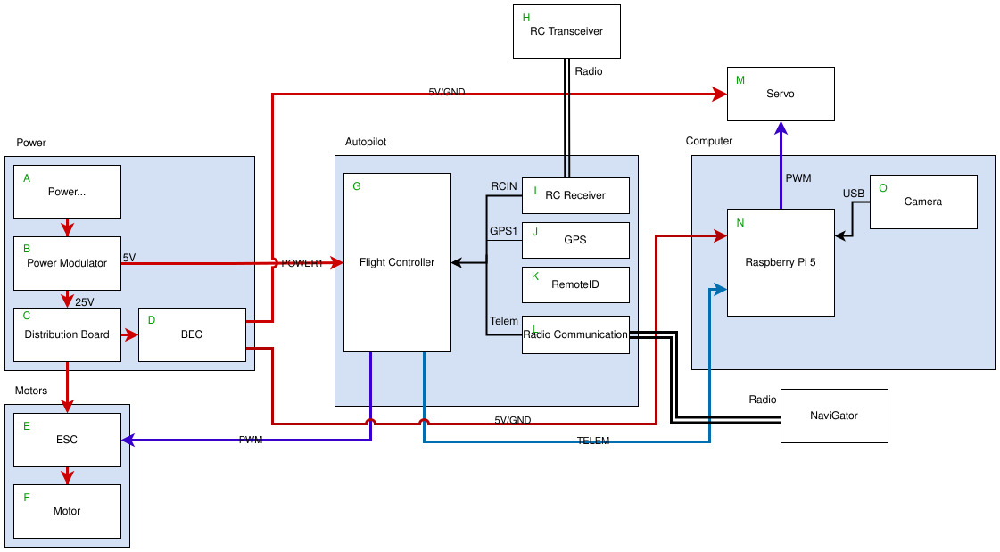

# System Architecture

The InvestiGator system is composed of two main computers, the [OrangeCube+ Flight Controller](flight_controller.md) and the Raspberry Pi 5 Companion Computer.

## Power

Power is supplied by a 1000mAHr 6S battery. It is connected to a Cube Powerbrick Mini via an EC5-to-XT60 adapter. The Powerbrick passes along the 25V to six female XT30 connectors.

The Powerbrick converts the 25V from the battery to the 5V needed to power the OrangeCube+.

The four ESCs and motors are supplied power from the XT30 connectors. Two universal battery elimination circuits (UBEC) are connected to the remaining XT30 connections to down convert the 24V to 5V. These connections power the Raspberry Pi 5, magnet, and RFD900x radio.

> [!NOTE]
> The RFD900x radio must be powered by the battery through a UBEC or other converter. The OrangeCube+ cannot power it directly.

## Flight Controller

The OrangeCube+ is the sensor hub and brain of the InvestiGator flight system. It runs the [ArduPilot]() software to fuse data from GPS, barometer, and IMUs to determine the power necessary to drive each of the motors to control flight.

## Motors

## Companion Computer
